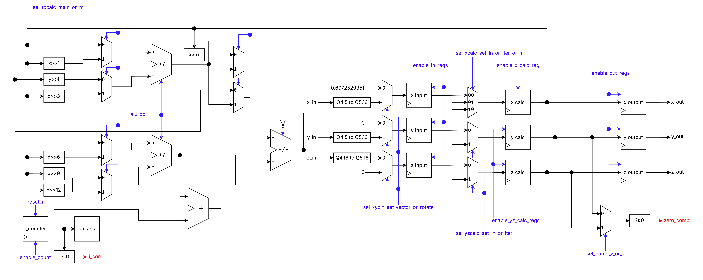

# CORDIC
COordinate Rotation DIgital Computer (CORDIC) implementation on VHDL.

## General
This project implements the classic CORDIC algorithm; it's used to calculate:

- Sine of an angle
- Cossine of an angle
- Length (magnitude) of a vector
- Arctangent associated with a vector

It has two modes of operation:

1. Rotation: Takes a given angle and calculates its sine and cossine.

2. Vectoring: Takes a vector (by giving the $x$ and $y$ components) to calculate its length and the arctangent of $y/x$ (which lies between $-π/2$ and $π/2$).

## Finite State Machine

1. *idle_v*
    - The initial state.
    - Waits till `mode=0` (which changes the state to `idle_r`) or `start=1` (which changes the state to *init*).
    - Only the given values of $x$, $y$ are stored, since idle_v is chosen to precede Vectorization if `start` turns to `1`; $z$ is set to $0$.
    - Both $x$, $y$ inputs are given (by the user) through fixed point representation Q4.5 (4 bits alocated to the integer part, 5 bits to the decimal part); the algorithm converts them to Q5.16.
    - `done` gets assigned to $0$.

2. *idle_r*
    - Waits till `mode=1` (which changes the state to `idle_v`) or `start=1` (which changes the state to *init*).
    - Only the given value of $z$ is stored, since *idle_r* is chosen to precede Rotation if `start` turns to `1`; $x$ is set to $0.6072529351$ (considering the scalling factor) and $y$ is set to $0$.
    - $z$ input is given (by the user) through fixed point representation Q4.16 (4 bits alocated to the integer part, 16 bits to the decimal part); The algorithm converts it to Q5.16.
    - `done` gets assigned to $0$.

3. *init*
    - Assign the values stored initially to the registers in which the calculations are performed.
    - If `mode=0`, goes to the Rotation path (which starts in *check_r*).
    - If `mode=1`, goes to the Vectorization path (which starts in *check_v*).

4. *check_r*
    - If $i≥16$, the next state is *ends*.
    - If $¬(i≥16)$ and $z≥0$, the next state is *iter_2_r*.
    - If $¬(i≥16)$ and $¬(z≥0)$, the next state is *iter_1_r*.

5. *check_v*
    - If i≥16, the next state is *adjust_x*.
    - If ¬(i≥16) and z≥0, the next state is *iter_1_v*.
    - If ¬(i≥16) and ¬(z≥0), the next state is *iter_2_v*.

6. *iter_1_r*
    - Performs the following assignments/calculations:
        - $x ← x + (y>>i)$
        - $y ← y - (x>>i)$
        - $z ← z + $ arctans( $i$ )
        - $i ← i + 1$
    - arctans is a table of precomputed values of arctan( $2^(-i)$ )

7. iter_2_r
    - Performs the following assignments/calculations:
        - $x ← x - (y>>i)$
        - $y ← y + (x>>i)$
        - $z ← z - $ arctans( $i$ )
        - $i ← i + 1$
    - arctans is a table of precomputed values of arctan( $2^(-i)$ )

8. *iter_1_v*
    - Performs the following assignments/calculations:
        - $x ← x - (y>>i)$
        - $y ← y + (x>>i)$
        - $z ← z - $ arctans( $i$ )
        - $i ← i + 1$
    - arctans is a table of precomputed values of arctan( $2^(-i)$ )

9. *iter_2_v*
    - Performs the following assignments/calculations:
        - $x ← x + (y>>i)$
        - $y ← y - (x>>i)$
        - $z ← z + $ arctans( $i$ )
        - $i ← i + 1$
    - arctans is a table of precomputed values of arctan( $2^(-i)$ ).

10. *adjust_x*
    - This state is exclusive to the Vectorization path, since the pre-adjustment is performed in Rotation only.
    - $x$ gets assigned to an aproximation of its value multiplied by $0.6072529351$, which is done through $[(𝑥≫1)+(𝑥≫3)]−{[(𝑥≫6)+(𝑥≫9)]+(𝑥≫12)}$

11. *ends*
    - This state is common to both paths.
    - It assigns the calculated values to the output registers and signals the end of the path through `done ← '1'` .

## Datapath

P.S. How additions and subtractions are handled:
- There're 3 ALUs, which perform either addition or subtration, they're used in two cases:
    1. To perform the subtractions and additions in the iteractive process.
    2. To perform 2 additions and 1 subtraction in the *adjust_x* state.
- There's also an adder, which is only used in *adjust_x*.

## Auxiliary diagrams

### FSM with the RTL elements

### FSM with control signals

## Acknowledgements
This repository is a remake of a project developed under UFSC's (Universidade Federal de Santa Catarina) Digital Systems course — INE5406, which was led by the professors Cristina Meinhardt, Ismael Seidel, José Luís A. Güntzel.

The group original members were (in alphabetical order):
- Gabriel João Martins
- Lucas Soares Ramos
- Luiz Fernando M. G. da Silva
- Nathan S. Schunk
- Thiago Ferrira de Castro
